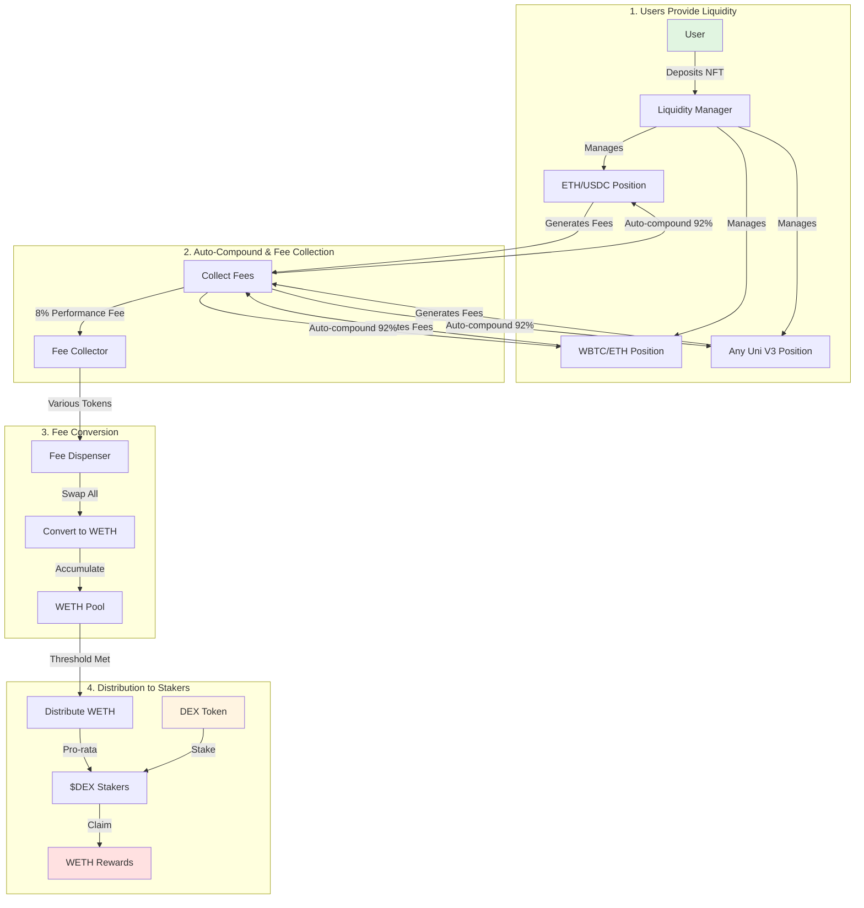

# Dexter Protocol Token Flow

## 🔄 Complete Token Flow Diagram



## 📊 Key Components

### 1. **Liquidity Positions** (Any Uniswap V3 Pair)
- Users can deposit ANY Uni V3 position NFT
- Examples: ETH/USDC, WBTC/ETH, PEPE/ETH, etc.
- Dexter manages these positions automatically

### 2. **Fee Collection & Auto-Compound**
- Collects trading fees from positions
- Auto-compounds 92% back into positions
- Takes 8% performance fee on profits only

### 3. **Fee Conversion to WETH**
- All collected fees (various tokens) sent to Fee Dispenser
- Automatically swapped to WETH via Uniswap
- WETH accumulates until distribution threshold

### 4. **$DEX Token Staking**
- Users stake $DEX tokens to earn protocol revenue
- WETH distributed pro-rata based on stake %
- Example: If you stake 10% of all $DEX, you get 10% of WETH rewards

## 💰 Example Scenario

1. **Alice deposits** ETH/USDC position worth $100,000
2. **Position earns** $1,000 in trading fees (mix of ETH and USDC)
3. **Auto-compound**: $920 reinvested into position
4. **Protocol fee**: $80 (8% of profit) sent to Fee Dispenser
5. **Conversion**: $80 worth of ETH/USDC converted to WETH
6. **Distribution**: When threshold hit, WETH sent to $DEX stakers

## 🎯 Benefits

### For Liquidity Providers:
- Manage ANY token pair, not just $DEX pairs
- Auto-compounding maximizes returns
- Only pay fees on actual profits

### For $DEX Stakers:
- Earn WETH (blue-chip asset) not random tokens
- Revenue from ALL positions in protocol
- Sustainable yield from real protocol usage

## 📈 Growth Flywheel

```
More LPs → More Positions → More Fees → More WETH to Stakers → 
Higher $DEX Value → More Attention → More LPs
```